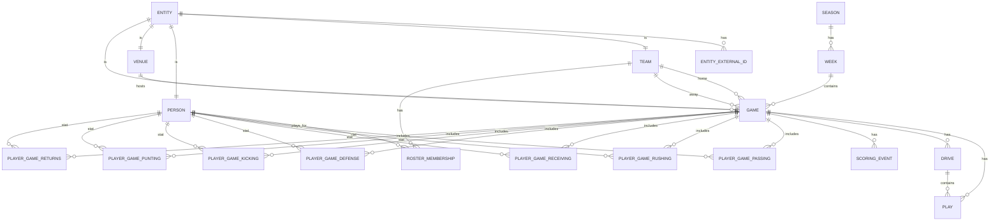

# NFL Local RAG-Datenbank (Privat) — Datenquellen, Architektur & Schema (v0.2)

> **Scope v0.2:** Update des Konzepts um (1) **Spielverläufe / Scoring-Timelines** („wer wann gepunktet hat“) und (2) **Spieler-Performance-Daten** pro Spiel/Woche/Saison, positionsspezifisch.  
> **Ziel:** Eine **lokale, konsistente, historisierte NFL-Datenbank** (15 Jahre Backfill + laufende Updates), die später (a) lokale Web-UIs und (b) eine ChatGPT-Bridge/RAG nutzen kann.

---

## 0) Design-Prinzipien (Engineering Manifest kompatibel)

- **Correctness > Cleverness**: Datenintegrität, eindeutige Keys, Constraints, Checks, Quarantäne.
- **Small Batches**: End-to-End-Bolts (z. B. „Schedules+Teams“, dann „PBP+Scoring“, dann „Player Stats“).
- **Observability ist ein Feature**: Run Registry + strukturierte Logs + DQ-Metriken.
- **Fail-Fast oder geplante Degradation**: Keine „stillen“ Fallbacks; Partial-Runs nur bewusst.
- **Zero-Trust gegenüber Quellen**: Provenance pro Datensatz; Konsolidierung/Checks statt blindes Upsert.

*(Siehe Engineering Manifest v2.0 im Projekt-Repo.)*

---

## 1) Daten-Domänen & Quellenstrategie (inkl. Redundanz)

### 1.1 Kern-Backbone (Bulk, historisch + laufend)

**nflverse / nflreadr / nflfastR / nfldata** (Primärquelle)
- **Schedules/Games/Teams/Players/Rosters** (bulk + regelmäßige Updates)
- **Play-by-Play (PBP)** (seasonweise, nightly aktualisiert)
- **Game- & Player-Stats** (weekly/game/season)
- Vorteile: Parquet/CSV-Releases, reproduzierbar, gut dokumentierte Feldbedeutungen.

### 1.2 Lückenfüller + Redundanz

**ESPN Core / Site APIs (JSON, „undokumentiert“ aber stabil in der Praxis)**
- **Preseason** (SeasonType=1) als Ergänzung, wenn Primärdataset Lücken hat.
- **Injuries** (insbesondere ab 2025, falls nflverse Injury-Pipeline Lücken hat).
- **Venues/Coaches** mit IDs und Metadaten (indoor/grass/address etc.).

### 1.3 Wetter (Optional in Iteration 2+)

- **Game-Level Weather Fields** (temp/wind/roof/surface) aus nflverse/nfldata als MVP.
- **NOAA ISD** (Stationszeitreihen) als Enrichment: Stadium→Station→Kickoff-Zeitfenster.

---

## 2) Daten-Pipeline-Architektur (Layered, robust)

### 2.1 Layer 1 — Raw Landing Zone (immutable)
- Speichert **unveränderte** Downloads/Responses.
- Struktur (Beispiel):
  - `raw/nflverse/pbp/season=2021/*.parquet`
  - `raw/nflverse/schedules/*.parquet`
  - `raw/espn/events/year=2021/type=2/week=6.json`

**Raw-Metadaten** (pro Datei/Objekt):
- `source`, `retrieved_at`, `request_params`, `payload_hash`, `size_bytes`

### 2.2 Layer 2 — Staging (source-genau, typisiert)
- Pro Quelle/Datensatz eine Staging-Tabelle (oder JSONB + typed views).
- Ziel: Parsing/Typisierung ohne semantische „Uminterpretation“.

### 2.3 Layer 3 — Canonical Core (dein „Single Source of Truth“)
- Normalisierte, konsistente Tabellen + Constraints.
- Enthält **reconciled** (konsolidierte) Daten, inklusive Historisierung.

### 2.4 Layer 4 — Audit/Observability
- **Run Registry** (`audit.ingest_run`) inkl. Outcomes (ok|partial|fail).
- **DQ Checks**: Pass Rate, Constraint Violations, Reconciliation Conflicts.
- **Quarantäne**: Datensätze, die Checks nicht bestehen, werden isoliert gespeichert.

---

## 3) Updated Canonical Data Model (v0.2)

### 3.1 Canonical IDs & External-ID Mapping (Pflicht)

**Warum:** nflverse arbeitet z. B. mit GSIS-IDs (Player), ESPN hat eigene IDs. Für Konsolidierung brauchst du saubere Mapping-Layer.

**Tabellenkern:**
- `core.entity(entity_id, entity_type, created_at)`
- `core.entity_external_id(entity_id, source, id_type, external_id, valid_from, valid_to)`
  - UNIQUE `(source, id_type, external_id, valid_from)` oder ohne validity, wenn IDs stabil.

### 3.2 Domänen-Entitäten (Dimensionen)

#### Seasons/Weeks
- `core.season(season_year, start_date, end_date)`
- `core.week(season_year, season_type, week, week_start, week_end)`
  - `season_type ∈ {PRE, REG, POST}`

#### Teams & Venues
- `core.team(team_id, abbr, name, location, conference, division, ... )`
- `core.venue(venue_id, full_name, city, state, country, capacity, grass, indoor, lat, lon)`
  - `lat/lon` optional (für NOAA später)

#### Persons (Players, Coaches, Officials)
- `core.person(person_id, full_name, first_name, last_name, birth_date, ... )`
- `core.person_role(person_id, role, valid_from, valid_to)`
  - `role ∈ {player, coach, official}`

#### Rosters / Membership
- `core.roster_membership(person_id, team_id, season_year, status, valid_from, valid_to)`
  - Historisierung ist wichtig (Transactions/IR/Practice Squad etc.).

---

## 4) Spiele, Spielverlauf, Scoring (NEU/ausgebaut)

### 4.1 Game (Faktentabelle)

**`core.game`** (ein Datensatz pro Game)
- Keys:
  - `game_id` (FK→`core.entity`)
  - `nflverse_game_id` (UNIQUE; z. B. `2021_06_BUF_KC`)
- Felder:
  - `season_year`, `season_type`, `week`
  - `kickoff_utc`, `venue_id`
  - `home_team_id`, `away_team_id`
  - `status` (scheduled|in_progress|final)

**`core.game_result`** (nur wenn final/teilfinal)
- `game_id`, `home_score`, `away_score`, `winner_team_id`, `overtime_flag`, `finalized_at`

### 4.2 Drives (optional, aber praktisch)

PBP enthält Drives/Series-Informationen. Drives sind ideal für:
- Scoring-Zusammenfassungen („Drive result: TD/FG/Punt…“)
- Tempo/Field-Position Analysen
- Konsistenzchecks (Scoring-Events müssen in einem Drive verankert sein)

**`core.drive`** (0..n pro Game)
- Key: `(game_id, drive_id)` oder `drive_uid` (surrogate)
- Typische Felder:
  - `drive_id` (Quelle), `start_qtr`, `start_clock`, `start_yardline`, `start_yards_to_goal`
  - `end_qtr`, `end_clock`, `end_yardline`, `end_yards_to_goal`
  - `plays`, `yards_gained`, `time_of_possession_sec`
  - `result` ENUM (Beispiele): `TD|FG|PUNT|INT|FUMBLE|DOWNS|SAFETY|END_HALF|END_GAME|MISSED_FG|TURNOVER_ON_DOWNS|UNKNOWN`
  - `posteam_id`

> Hinweis: Einige Quellen enthalten Drive-IDs nur implizit; wir können Drive-IDs aus PBP-Feldern wie `drive` übernehmen.

### 4.3 Play-by-Play (PBP) — „Spielverlauf“ als Ground Truth

**`core.play`** ist die große Faktentabelle.

**Primary Key (konzeptionell):** `(game_id, drive, play_id)`  
Diese Kombi ist im nflfastR/nflverse-Kontext der übliche eindeutige Play-Identifier.

**`core.play` (Auszug wichtiger Felder)**
- Identität/Position:
  - `game_id`, `drive`, `play_id`, `qtr`, `game_seconds_remaining`
  - `yardline_100`, `ydstogo`, `down`
- Teams/Context:
  - `posteam_id`, `defteam_id`, `home_team_id`, `away_team_id`
  - `score_differential`, `total_home_score`, `total_away_score`
- Beschreibung/Typ:
  - `play_type`, `desc`
  - `shotgun`, `no_huddle`, `qb_dropback`, `pass_length`, `run_location`, ...
- Output/Advanced:
  - `yards_gained`, `epa`, `wp`, `wpa` (wenn verfügbar)
- Referenzen auf Player (soweit Quelle liefert):
  - `passer_person_id`, `rusher_person_id`, `receiver_person_id`, `kicker_person_id`, ...

> **Wichtig:** Die PBP-Tabelle ist dein **vollständiger Spielverlauf**. Alles andere (Drive Summary, Scoring Timeline, Player Stats) kann daraus abgeleitet und/oder mit externen Quellen gegengeprüft werden.

### 4.4 Scoring Timeline — „Wer wann gepunktet hat“ (NEU)

Wir speichern Scoring **als eigene, schlanke Timeline**, die aus PBP extrahiert wird (und optional gegen Boxscore/Summary-APIs validiert).

**`core.scoring_event`** (0..n pro Game)
- Key:
  - `scoring_event_id` (surrogate) oder `(game_id, scoring_seq)`
- Felder:
  - `game_id`
  - `scoring_team_id`
  - `qtr`, `clock` (z. B. `MM:SS`), `game_seconds_remaining`
  - `drive` (optional), `play_id` (FK → `core.play`)
  - `score_home_after`, `score_away_after`
  - `points` (2|3|6|7|8|…)
  - `score_type` ENUM: `TD|FG|SAFETY|XP|TWO_PT|DEF_TD|RETURN_TD|OTHER`
  - `scorer_person_id` (optional; z. B. Rusher/Receiver/Kicker)
  - `description` (kurz; aus PBP desc)

**Ableitung aus PBP (robust):**
- PBP enthält in der Regel Felder wie `td_team`, `field_goal_result`, `extra_point_result`, `two_point_conv_result` und/oder Score-After-Play-Felder.  
- Ein Scoring Event entsteht, wenn sich `total_home_score` oder `total_away_score` gegenüber dem vorherigen Play erhöht.

**Wichtig zur Granularität (TD + XP/2PT):**
- In PBP sind Touchdown, PAT (XP) und 2PT-Conversion häufig **eigene Plays**. Dann entstehen auch **mehrere** Scoreboard-Änderungen kurz hintereinander.
- Empfehlung: `core.scoring_event` speichert **jede Scoreboard-Änderung** als eigenes Event (also i. d. R. getrennt für TD und XP/2PT). Das ist am robustesten und erlaubt exakte Zeitachsen.
- Optional kann eine View `mview.scoring_sequence_compact` TD+PAT zu einem „Drive Score“ zusammenziehen (für UI).

**Konsistenzchecks:**
- `score_home_after + score_away_after` muss monoton nicht-fallen.
- Final Score aus `core.game_result` muss dem letzten `scoring_event` entsprechen.
- `points` muss aus Differenzen ableitbar sein.

### 4.5 Game Flow Summaries (Materialisierte Sichten)

Für schnelle Queries in UI/RAG:
- `mview.game_scoring_summary` (Scoring events + Teams + Names)
- `mview.game_drive_summary` (Drive outcomes)
- `mview.game_win_probability_curve` (wenn WP/WPA vorhanden; optional)

**`core.game_environment`** (MVP-Wetter)
- `game_id`, `roof`, `surface`, `temp`, `wind`
## 5) Spieler-Performance-Daten (NEU/ausgebaut)

Du willst „für jeden Spieler bzw. jede Position die relevanten Performance-Daten“.
Das führt zu viel Datenvolumen — aber ist absolut machbar, wenn wir **sauber modellieren** und **partitionieren**.

### 5.1 Prinzip: Typed Stat Tables pro Kategorie

Statt einer riesigen „Wide Table“ mit 200 Spalten nutzen wir **Kategorie-Tabellen** (sauber, performant, stabil) und optional eine „Extra“-Tabelle für seltene Felder.

**Gemeinsame Keys (für alle Player-Game-Stats):**
- `(season_year, game_id, team_id, player_person_id)`
- plus `position` (zum Zeitpunkt; optional aus Rosters/Depth Charts)

### 5.2 Welche Stat-Kategorien sind „relevant“ je Position? (praktische Leitlinie)

Das ist kein hartes Schema-Constraint, sondern eine **Query-/View-Leitlinie**:

- **QB:** Passing (+ optional Rushing, Fumbles, Snaps, Advanced)
- **RB:** Rushing + Receiving (+ Fumbles, Returns optional)
- **WR/TE:** Receiving (+ Rushing/Returns optional)
- **OL:** Snaps + Penalties (falls Quelle vorhanden); klassische Boxscore-Stats sind begrenzt
- **DL/LB/DB:** Defense + Snaps (+ INT/PD/FF/FR etc.)
- **K:** Kicking
- **P:** Punting
- **KR/PR (rollenbasiert):** Returns (zusätzlich zu eigentlicher Position)

Wir speichern die Kategorien **für alle Spieler**, die im Game in der jeweiligen Kategorie auftauchen (z. B. ein WR kann auch Rushing/Returns haben).

### 5.3 Player Game Stats — Kategorie-Tabellen

**Primär-Ingestion (empfohlen):** Importiere Player-Stats aus den kuratierten nflverse/nflreadr-Datensätzen (weekly/game/season), weil diese bereits Boxscore-Logik, Korrekturen und Edge-Cases abbilden.

**Sekundär (optional):** Leite zusätzliche/fortgeschrittene Metriken aus `core.play` ab (z. B. EPA/WPA-Attribution), und nutze Boxscore/Summary-Quellen nur als Cross-Check.

#### Passing
**`core.player_game_passing`**
- `attempts`, `completions`, `pass_yards`, `pass_tds`, `ints`
- `sacks`, `sack_yards`, `air_yards`, `yac`, `cpoe` (wenn verfügbar)
- `qb_hits` (wenn verfügbar)

#### Rushing
**`core.player_game_rushing`**
- `carries`, `rush_yards`, `rush_tds`, `rush_long`, `rush_1d`
- `fumbles` (oder separat)

#### Receiving
**`core.player_game_receiving`**
- `targets`, `receptions`, `rec_yards`, `rec_tds`, `rec_long`, `rec_1d`
- `air_yards`, `yac`, `drops` (wenn verfügbar)

#### Defense (Boxscore-Level)
**`core.player_game_defense`**
- `tackles_combined`, `tackles_solo`, `tackles_ast`
- `sacks`, `qb_hits`, `tfl`
- `passes_defended`, `ints`, `int_yards`, `int_tds`
- `forced_fumbles`, `fumble_recoveries`, `def_tds`

#### Kicking
**`core.player_game_kicking`**
- `fgm`, `fga`, `fg_long`, `xpm`, `xpa`

#### Punting
**`core.player_game_punting`**
- `punts`, `punt_yards`, `punt_long`, `punts_inside_20`, `touchbacks`, `blocked`

#### Returns
**`core.player_game_returns`**
- `kr`, `kr_yards`, `kr_tds`, `kr_long`
- `pr`, `pr_yards`, `pr_tds`, `pr_long`

#### Fumbles (optional separat)
**`core.player_game_fumbles`**
- `fumbles`, `lost`, `forced`, `recovered`

#### Snaps / Participation (wenn Quelle vorhanden)
**`core.player_game_snaps`**
- `offense_snaps`, `defense_snaps`, `st_snaps`
- `offense_pct`, `defense_pct`, `st_pct`

### 5.4 Vereinheitlichte Abfrage-Schicht (Views) — für UI/RAG/Analytics

Damit man nicht je Query 6 Stat-Tabellen joinen muss, definieren wir bewusst eine **Union-View**:

**`view.player_game_stat_all`** (one row per player-game-category)
- Keys: `(season_year, game_id, team_id, player_person_id, stat_category)`
- Felder:
  - `stat_category` ENUM: `passing|rushing|receiving|defense|kicking|punting|returns|fumbles|snaps|advanced`
  - `stats_json` (JSONB) enthält die Kategorie-Felder als Key/Value
  - Zusätzlich ein paar „common“ Spalten für schnelle Filter: `position`, `opponent_team_id`, `game_week`, `season_type`

Vorteil: UI/RAG kann **einheitlich** arbeiten (z. B. „zeige alle Stats für Player X in Game Y“), während die Core-Tabellen trotzdem typed und performant bleiben.

### 5.5 Aggregationen (Week/Season) — materialisierte Views oder eigene Tabellen

Je nach DB-Engine:
- als **Materialized Views** (schnell, aber Refresh-Logik nötig), oder
- als eigene Tabellen (einfacher ETL, klare Provenance)

Empfohlen:
- `core.player_week_*` Tabellen analog zu `player_game_*`
- `core.player_season_*` Tabellen

**Wichtig:** Aggregationen müssen deterministisch sein (aus `player_game_*` oder aus Primärquelle) und einen `source_snapshot_id` bekommen.

### 5.6 Advanced Player Metrics (optional, aber stark für Analysen)

Zwei Wege:
1) **Direkt aus nflverse/nflfastR Stats** (falls vorhanden)
2) **Reproduzierbar aus PBP aggregieren** (z. B. EPA pro Spieler via Play Attribution)

Dafür:
- `core.player_game_advanced(player_person_id, game_id, epa_total, epa_pass, epa_rush, wpa_total, success_rate, ...)`

### 5.7 Team Performance (ergänzend, sehr nützlich)

Für viele Analysen ist ein Team-Layer hilfreich (auch für RAG „Team Form“):

**`core.team_game_stat`** (ein row pro Team pro Game)
- Keys: `(season_year, game_id, team_id)`
- Typische Felder: Punkte, Yards, Plays, Success-Rate (falls vorhanden), Turnovers, Penalties, Time of Possession, Third Down Rate, Red Zone, Sacks usw.

**`core.team_week_stat`**, **`core.team_season_stat`** analog.

Team-Stats dienen außerdem als Cross-Check gegen Summe der Player-Stats (nicht immer exakt, aber plausibilitätsstark).

---

## 6) Konsolidierung & Datenkonsistenz (Multi-Source Reconciliation)

### 6.1 Provenance (immer)
Jede Canonical-Row hat mindestens:
- `source` (nflverse|espn|noaa|…)
- `source_snapshot_id` (FK → `audit.source_snapshot` oder in `audit.ingest_run` referenziert)
- `retrieved_at`
- optional `confidence` / `priority`

### 6.2 Reconciliation-Regeln (Beispiele)

**Game Result:**
- Wenn `status=final`: Scores müssen zwischen Primär- und Secondary-Quelle matchen.
- Konflikte → Quarantäne + Alert.

**Scoring Timeline:**
- Sum(points) = Final Score.
- Scoreboard nach jedem Event monoton.

**Player Stats:**
- Boxscore-Stats müssen plausibel sein (z. B. completions ≤ attempts).
- Wenn gleiche Kategorie aus zwei Quellen: definierte Priorität (z. B. nflverse > ESPN), aber Konflikte protokollieren.

### 6.3 Quarantäne statt stiller Fehler
- `audit.quarantine_{domain}` enthält:
  - original row(s), reason_code, checks_failed, source_snapshot_id, discovered_at

---

## 7) Datenvolumen & Performance (lokaler Laptop, aber „groß“)

### 7.1 Erwartetes Wachstum
- **PBP** ist der größte Treiber.
- Player Stats sind moderat groß (pro Game ~ 22+ Starter + Rotations → hunderte rows, aber überschaubar).

### 7.2 Physisches Design (DB-agnostisch, aber konkret)

**Partitionierung:**
- `core.play` partitioniert nach `season_year`.
- Optional zusätzlich nach `season_type`.

**Indizes (Minimum):**
- `core.game(nflverse_game_id)` unique
- `core.play(game_id, play_id)`
- `core.scoring_event(game_id, event_order)`
- `core.player_game_* (game_id, player_person_id)`

**Storage Pattern:**
- Raw = Parquet/JSON (filesystem)
- Core = relational (Postgres) **oder** analytisch (DuckDB) je nach ADR.

---

## 8) Ingestion-Interfaces (Connector Contract)

Jeder Connector implementiert:
- `discover()` — welche Seasons/Weeks/IDs verfügbar
- `fetch(request)` — Timeouts, Retry, Backoff+Jitter, Circuit Breaker
- `store_raw(payload)` — immutable + hash
- `parse_to_staging(payload)` — typisiert
- `validate(staging_rows)` — DbC/DQ
- `upsert_core(staging_rows)` — idempotent
- `reconcile(core, staging)` — Konflikte/Quarantäne
- `emit_metrics(run_id)` — Counts, Outcomes, Latency, Retries

**Connector-Set v0.2:**
- `NflverseConnector`: schedules, teams, players, rosters, pbp, stats
- `ESPNConnector`: preseason/events, injuries, venues/coaches
- `NOAAConnector` (optional später)

---

## 9) Iterationsplan (konkret, kleine Bolts)

### Bolt A — Schema v0.1 + Run Registry
- Core: entity + external_id_map + team + venue + season/week + game
- Audit: ingest_run + source_snapshot + quarantine tables

### Bolt B — PBP Ingestion + Plays + Drives
- Ingest `pbp` seasonweise
- Build `core.play` partitions
- Derive `core.drive`

### Bolt C — Scoring Timeline
- Derive `core.scoring_event` aus `core.play`
- DQ: Score consistency
- Optional: ESPN summary cross-check für ausgewählte Games

### Bolt D — Player Game Stats (Kategorie-Tabellen)
- Ingest player/game/week stats aus nflverse
- Populate `core.player_game_*` Tabellen
- DQ: Plausibility checks

### Bolt E — Injuries + Preseason
- ESPN injuries + preseason events
- Mapping auf core.player/core.game

### Bolt F — Weather Enrichment
- NOAA station mapping + hourly obs um kickoff

---

## 10) RAG-Vorbereitung (ohne Implementierung, aber schema-ready)

Auch wenn wir aktuell „nur DB“ bauen, sollten wir Retrieval später leicht machen:

- **Dokumentansichten** (Views) für RAG:
  - `view.game_summary_document` (ein „Text-Dokument“ pro Spiel: Teams, score timeline, key plays, injuries)
  - `view.player_season_document` (ein „Text-Dokument“ pro Spieler/Saison)
- Diese Views sind **reproduzierbar** aus Core Tabellen und vermeiden, dass wir „Halluzinations-Text“ speichern.

---

## 11) Offene ADRs (als nächste Entscheidung)

1) **DB Engine**: Postgres (mit Partitionierung + später pgvector) vs DuckDB (Parquet-first, super lokal-analytisch).
2) **Transformations-Orchestrierung**: Python (dbt-core? dagster? plain scripts?) — klein starten.
3) **Canonical ID Strategy**: UUID vs int sequences.
4) **Materialized Views vs ETL Tabellen** für week/season Aggregationen.

---

## Appendix A — Mermaid ERD (konzeptionell)

---

## Appendix B — Minimal DQ Checkliste (v0.2)

**Game:**
- `nflverse_game_id` unique
- `home_team_id != away_team_id`
- kickoff in plausible range

**Play:**
- (game_id, drive_id, play_id) unique
- play order monoton (falls ein order field existiert)

**Scoring:**
- event_order unique pro game
- scoreboard monotonic
- sum(points) == final score (final games)

**Player Stats:**
- passing: completions ≤ attempts
- kicking: fgm ≤ fga; xpm ≤ xpa
- yards plausibel (>=0; Ausnahmen bei Sacks/Team plays je nach Quelle)

---

## Appendix C — Query-Beispiele (später hilfreich)

- „Zeige Scoring Timeline für Game X“
- „Alle Lead Changes in Week 12, Season 2022“
- „QB EPA & Passing Yards pro Game für Player Y in Season 2020“
- „Top 10 Rusher (rush_yards) REG 2016“

---

## References (öffentliche Quellen / Einstiegspunkte)

- nflverse GitHub (Datasets/Releases): https://github.com/nflverse/nflverse-data/releases
- nflreadr Dokumentation (Dictionaries, Update-Cadence): https://nflreadr.nflverse.com/
- nflfastR Field Descriptions (PBP-Felder): https://nflfastr.com/articles/field_descriptions.html
- ESPN NFL API Übersicht (Community-Gist): https://gist.github.com/nntrn/ee26cb2a0716de0947a0a4e9a157bc1c
- NOAA Integrated Surface Database (ISD): https://www.ncei.noaa.gov/products/land-based-station/integrated-surface-database

> Hinweis: Terms/Lizenzfragen behandeln wir im Projekt als eigenes ADR (Engineering-Risiko: Provenance dokumentieren, Source-Swap möglich halten).

